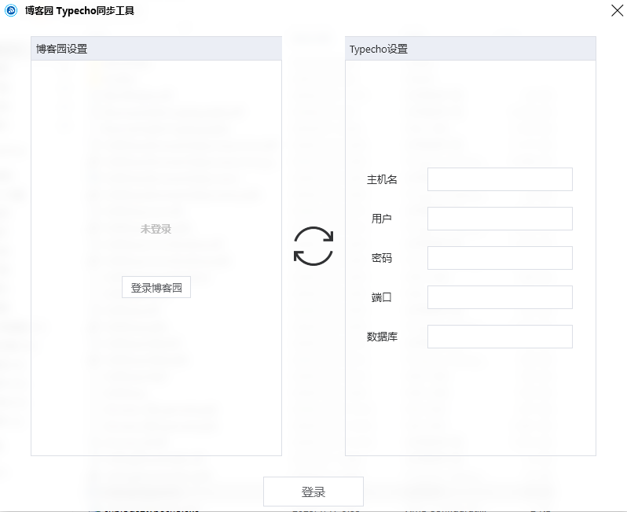
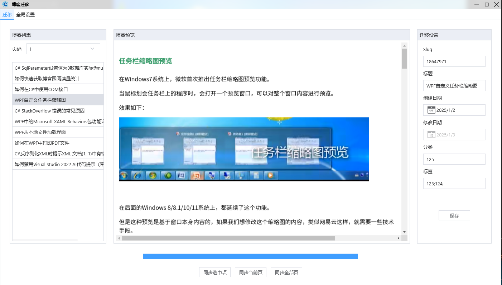

## cnblogs2typecho
将博客园的文章同步到typecho

## 使用步骤
1、登录博客园，登录完成后，关闭登录界面
2、输入typecho数据连接参数，连接typecho数据库
3、点击登录按钮
4、配置typecho网站根目录(root)、数据上传目录(root/usr/uploads)及站点网站
5、点击对应的按钮同步文章，支持单个、整页及全部。

**注意：需要将同步程序运行在typecho服务器上，如果不在typecho服务器上运行，需要将uploads文件夹下的文件拷贝到服务器上**

## 使用演示
https://www.bilibili.com/video/BV1JxNgeeE2T/

## 界面截图

登录
   

主界面
 
 

## LICENSE
[MIT](LICENSE)

